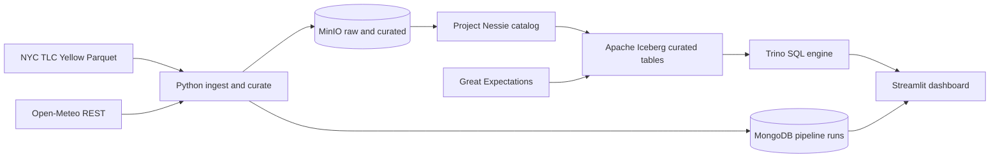
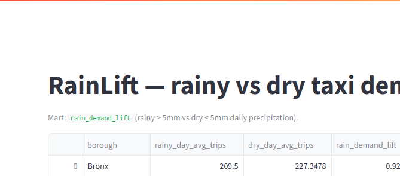
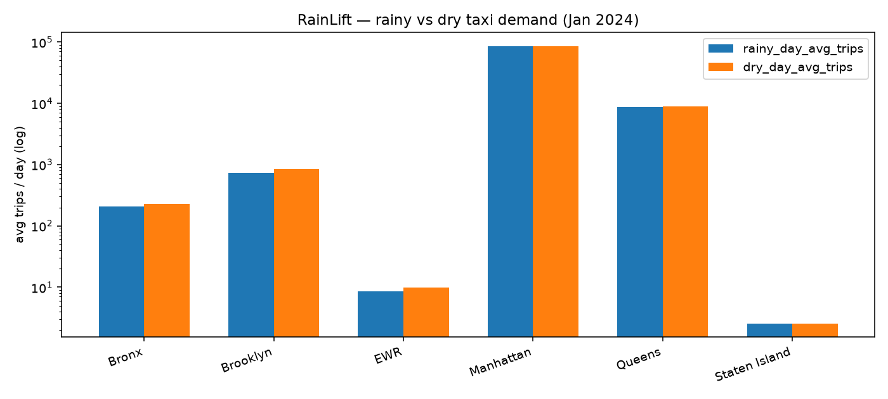

# RainLift

A fully local Docker lakehouse pipeline that ingests real NYC taxi and weather data, stores curated Apache Iceberg tables on MinIO, queries them with Trino, tracks pipeline runs in MongoDB, enforces data contracts with Great Expectations, and answers whether New Yorkers take more taxis when it rains — with zero cloud accounts and zero dollars of spend.

## Architecture

## Debugging notes (real failures)

1. **Host `.env` vs Compose DNS** — Streamlit/pipeline hardcode `TRINO_HOST=trino`; host `.env` stays `localhost` for optional local Python.
2. **Trino on host 8088** — avoids Airflow on `8080`; containers still use `trino:8080`.
3. **CRLF on Windows** — broke `minio-init.sh` and Trino `node.properties`; keep LF.
4. **Nessie has no views** — marts are materialized Iceberg tables, not `CREATE VIEW`.

Longer write-up: **[docs/FAILURE_NOTES.md](docs/FAILURE_NOTES.md)**. Recorded green run: **[docs/validation-log.md](docs/validation-log.md)**.

## Quickstart

1. `cp .env.example .env` — host endpoints (`localhost`) for optional local Python. Keep MinIO credentials in sync with `configs/trino/catalog/iceberg.properties`. Streamlit always reaches Trino as Compose service `trino`.
2. `make up` — starts MinIO, Nessie, MongoDB, Trino, Streamlit, and MinIO bucket init.
3. `make ingest` — lands TLC Parquet + Open-Meteo JSON into MinIO `raw/` prefixes and writes Mongo run docs (runs in Compose `pipeline` by default; `HOST_PIPELINE=1` for local Python 3.11).
4. `make curate` — builds curated Iceberg tables `rainlift.tlc_trips` and `rainlift.weather_daily` via PyIceberg + Nessie.
5. `make quality` — Great Expectations on curated tables (JSON suites under `configs/great_expectations/expectations/curated/`, applied via Trino sample + full-table null audit).
6. `make mart` — applies `sql/trino/apply_order.txt` (mart SQL **last**).
7. Open Streamlit at `http://localhost:8501` (mart `rain_demand_lift`).

No `make`? Same steps via `docker compose up -d --build` then `docker compose run --rm pipeline -m rainlift.<ingest|curate|mart>` / `... -m rainlift.quality.run_ge`.

Developer tests: `make test` (`pytest` + `docker compose config`). Offline GE contract tests (`tests/test_quality_suites.py`) run in CI without spinning the lakehouse.

## Metric (Section 8)

- **Rainy day:** `precipitation_sum > 5.0` mm  
- **Dry day:** `precipitation_sum <= 5.0` mm  
- **`rain_demand_lift`** = `rainy_day_avg_trips / nullif(dry_day_avg_trips, 0)` with null + `insufficient_weather_variation` when a cohort is empty.

## Evidence (portfolio)

| Claim | Artifact |
|-------|----------|
| Pinned month + mart | `docs/evidence/trino_mart_sample.txt` |
| Iceberg row counts | `docs/evidence/trino_curated.txt` |
| Mongo runs | `docs/evidence/mongo_run.json`, `docs/evidence/mongo_ingest.txt` |
| Ingest proof | `docs/evidence/ingest_log.txt` |
| Great Expectations | `docs/evidence/ge_summary.txt` |
| Streamlit UI | `docs/evidence/streamlit_rain_demand_lift.png` |
| Mart chart | `docs/evidence/rain_demand_lift_chart.png` |
| No cloud deploy | `docs/audit_no_cloud.md` |
| E2E validation log | `docs/validation-log.md` |

## Deep dive

- **Raw:** immutable Parquet + JSON under `raw/tlc/year=YYYY/month=MM/` and `raw/weather/...`.
- **Curated:** Iceberg on MinIO, cataloged in Nessie (`warehouse=s3://curated/wh/`).
- **Trino:** catalog `iceberg`, schema `rainlift`, Iceberg tables `trip_weather_daily`, `rain_demand_lift` (materialized — Nessie does not support views). Host UI/API: Trino `:8088`, Streamlit `:8501`, MinIO console `:9001`.
- **Config:** [docs/specs/RAINLIFT_SPEC.md](docs/specs/RAINLIFT_SPEC.md).

### Limitations

Single Open-Meteo point (`WEATHER_LAT`/`WEATHER_LON`) proxies NYC weather for all boroughs. Borough comes from TLC `PULocationID` joined to the published taxi zone lookup CSV.

## CI

Workflow: **[`ci`](https://github.com/sauravpatel0512/RainLift/actions/workflows/ci.yml)** — Python 3.11, `ruff check`, `pytest` (`PYTHONPATH=src`), `docker compose config`. Local: `make lint` / `make test`.

**Version:** 0.1.0
