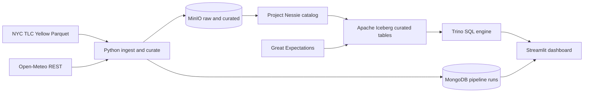

# RainLift

A fully local Docker lakehouse pipeline that ingests real NYC taxi and weather data, stores curated Apache Iceberg tables on MinIO, queries them with Trino, tracks pipeline runs in MongoDB, enforces data contracts with Great Expectations, and answers whether New Yorkers take more taxis when it rains — with zero cloud accounts and zero dollars of spend.

## Architecture

## Quickstart

1. `cp .env.example .env` and align credentials with `docker-compose.yml` / `configs/trino/catalog/iceberg.properties` (defaults match `.env.example`).
2. `make up` — starts MinIO, Nessie, MongoDB, Trino, Streamlit, and MinIO bucket init.
3. `make ingest` — lands TLC Parquet + Open-Meteo JSON into MinIO `raw/` prefixes and writes Mongo run docs.
4. `make curate` — builds curated Iceberg tables `rainlift.tlc_trips` and `rainlift.weather_daily` via PyIceberg + Nessie.
5. `make quality` — Great Expectations on curated tables (Trino reads).
6. `make mart` — applies `sql/trino/apply_order.txt` (mart SQL **last**).
7. Open Streamlit at `http://localhost:8501` (mart `rain_demand_lift`).

Developer tests: `make test` (`pytest` + `docker compose config`).

## Metric (Section 8)

- **Rainy day:** `precipitation_sum > 5.0` mm  
- **Dry day:** `precipitation_sum <= 5.0` mm  
- **`rain_demand_lift`** = `rainy_day_avg_trips / nullif(dry_day_avg_trips, 0)` with null + `insufficient_weather_variation` when a cohort is empty.

## Evidence (portfolio)

| Claim | Artifact |
|-------|----------|
| Pinned month + mart | `docs/evidence/trino_mart_sample.txt` (generate via Trino CLI) |
| Iceberg row counts | `docs/evidence/trino_curated.txt` |
| Mongo runs | `docs/evidence/mongo_run.json`, `docs/evidence/mongo_ingest.txt` |
| Ingest proof | `docs/evidence/ingest_log.txt` |
| Great Expectations | `docs/evidence/ge_summary.txt` |
| Streamlit | `docs/evidence/streamlit_rain_demand_lift.png` |
| No cloud deploy | `docs/audit_no_cloud.md` |

## Deep dive

- **Raw:** immutable Parquet + JSON under `raw/tlc/year=YYYY/month=MM/` and `raw/weather/...`.
- **Curated:** Iceberg on MinIO, cataloged in Nessie (`warehouse=s3://curated/wh/`).
- **Trino:** catalog `iceberg`, schema `rainlift`, views `trip_weather_daily`, `rain_demand_lift`.
- **Config:** `docs/specs/<<RainLift_SPEC>>.md`.

### Limitations

Single Open-Meteo point (`WEATHER_LAT`/`WEATHER_LON`) proxies NYC weather for all boroughs. Borough comes from TLC `PULocationID` joined to the published taxi zone lookup CSV.

## CI

Workflow: **`ci`** (`.github/workflows/ci.yml`) — Python 3.11, `pytest` with `PYTHONPATH=src`, `docker compose config`. Enable Actions on your fork to see the green run.

**Version:** 0.1.0
