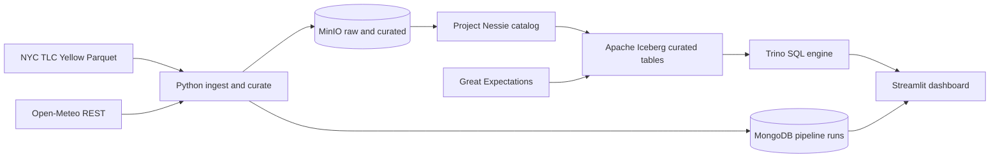

# RainLift Internal Build Specification

This document is the single source of truth for RainLift architecture, build sequence, constraints, and proof collection. All implementation decisions must align with this spec.

---

## Section 1 — Project Identity

### Project name and one-line recruiter pitch
- **Project name:** RainLift
- **Pitch:** A fully local Docker lakehouse pipeline that ingests real NYC taxi and weather data, stores curated Apache Iceberg tables on MinIO, queries them with Trino, tracks pipeline runs in MongoDB, enforces data contracts with Great Expectations, and answers whether New Yorkers take more taxis when it rains — with zero cloud accounts and zero dollars of spend.

### Three-sentence business problem
Mobility and weather interact in ways that matter for operations and policy, but joining trip facts to weather safely at scale requires a disciplined lakehouse pattern rather than ad-hoc CSV joins. RainLift demonstrates that you can land immutable raw files, promote curated Iceberg tables under a real catalog, validate data with contracts, and publish a single interpretable metric for stakeholders. The project proves local-first engineering discipline: reproducible containers, observable runs, and recruiter-visible outcomes without vendor spend.

### Single narrative a hiring manager should retain
You can build a modern lakehouse on open formats (Iceberg + Nessie), object storage (MinIO), federated SQL (Trino), NoSQL operational metadata (MongoDB), and explicit data quality (Great Expectations) — entirely on your machine, with one command to run the stack.

### Portfolio story fit (NexusFlow-X → OLISTMART → RainLift)
- **NexusFlow-X:** Kafka, Spark Structured Streaming, medallion Parquet, DuckDB, Streamlit, Docker, GitHub Actions.
- **OLISTMART:** Airflow, dbt, PostgreSQL Kimball star schema, REST ingestion, BI, GitHub Actions.
- **RainLift:** Iceberg + Nessie catalog, MinIO lake storage, Trino lake SQL, MongoDB ops metadata, Great Expectations contracts — no cloud vendor.

### Skills RainLift proves that NexusFlow-X and OLISTMART do not
- Apache Iceberg as the curated open table format with a real catalog (Project Nessie).
- MinIO as S3-compatible local object storage for raw and curated zones.
- Trino as federated lake SQL (conceptual analog to Presto/Athena on object storage).
- MongoDB for NoSQL operational metadata (pipeline runs, hashes, status).
- Great Expectations for data contracts and quality gates on raw and curated layers.
- End-to-end lakehouse architecture with **no** AWS, **no** payment card, **no** cloud service.

---

## Section 2 — Hard Constraints

### Allowed tools (with justification)
| Tool | Allowed | Why |
|------|---------|-----|
| Docker + Docker Compose | Yes | One-command local orchestration; reproducible environments. |
| MinIO | Yes | S3-compatible API for raw/curated zones without cloud object storage. |
| Project Nessie | Yes | Iceberg catalog with Git-like versioning; replaces Glue. |
| Apache Iceberg | Yes | Curated layer table format: ACID semantics, schema evolution. |
| PyIceberg | Yes | Python read/write for Iceberg tables against Nessie + MinIO. |
| Trino | Yes | SQL engine over Iceberg; local Presto/Athena analog. |
| MongoDB Community | Yes | NoSQL document store for pipeline run metadata. |
| Great Expectations | Yes | Data contracts and validation suites in CI and local runs. |
| Python 3.11 | Yes | Ingestion, transforms, orchestration glue, tests. |
| Streamlit | Yes | Fast, understandable dashboard for `rain_demand_lift`. |
| GitHub Actions | Yes | CI for lint, tests, compose validation on public repos (no cloud deploy). |

### Explicitly banned tools and approaches
- **Any cloud provider resource** (AWS, GCP, Azure, Snowflake, Databricks hosted, etc.): banned — violates zero-cloud and zero-card rules.
- **Any service that requires a payment method** to sign up, including “free tier” that mandates a card: banned.
- **Synthetic or generated trip data** as the primary analytical dataset: banned — public real data is required.
- **Unbounded ingestion** (multi-month or full-history TLC pulls): banned — single fixed month only.
- **Curated analytics directly on raw files** as the final deliverable: banned — curated layer must be Iceberg; raw is immutable landing only.
- **Skipping Great Expectations** on defined layers: banned — contracts are part of the proof story.

### Cost ceiling and enforcement
- **Target and maximum project spend:** **$0** — not “almost free,” not a small budget.
- **Enforcement:** No cloud accounts; no APIs requiring keys that imply paid tiers; all compute and storage are local containers and disk. Worst-case mistake (containers left running, loops in code) still produces **$0** billed spend because there is no billable cloud resource.

### Free-tier and “no card” clarification
RainLift does not rely on vendor free tiers. It relies on **open-source software run locally**. If a tool ever requires a cloud signup or card, it is out of scope.

---

## Section 3 — Architecture

### Architecture description (prose)
RainLift runs as a multi-container Docker Compose stack. **MinIO** provides S3-compatible buckets for a **raw** zone (immutable landed Parquet and JSON) and a **curated** zone (Iceberg table data and metadata). **Project Nessie** is the Iceberg **catalog**: it holds table metadata and enables Git-like references to Iceberg snapshots. **PyIceberg** (and supporting Python modules) ingests the fixed-month TLC Parquet slice, fetches **Open-Meteo** daily weather (no API key), lands raw artifacts to MinIO, then creates or updates **Iceberg** tables in the curated zone registered in Nessie.

**MongoDB** stores one document per pipeline run (or per dataset run) keyed by logical fields **`ingest_date`** and **`dataset`** (and unique run id as needed), including status, row counts, content hashes, and timestamps. **Great Expectations** validates expectations on raw and curated datasets before marts are built.

**Trino** is configured with connectors for **Iceberg** (via Nessie catalog) and queries curated tables. The final mart **`rain_demand_lift`** is implemented as the **last** Trino SQL artifact: a view or table exposing borough-level rainy vs dry average trip demand over the fixed month using the locked precipitation threshold. **Streamlit** reads Trino query results (or precomputed parquet/csv outputs produced by the mart step) and renders a chart recruiters understand in seconds.

### Complete Mermaid diagram (labels must include Iceberg and Nessie)


### Data flow step by step
1. Developer runs `make up` — Compose starts MinIO, Nessie, MongoDB, Trino, Streamlit (and any init sidecars).
2. Developer runs `make ingest` — Python downloads the fixed-month TLC Parquet URL, fetches Open-Meteo JSON for the same calendar window, writes immutable objects under raw prefixes in MinIO.
3. Ingestion writes MongoDB run documents with `ingest_date`, `dataset`, status, row counts, hashes.
4. Curate step uses PyIceberg + Nessie to create/update Iceberg tables in the curated zone (not raw).
5. Trino can register/query curated Iceberg tables (schemas/views as defined in `sql/trino/`).
6. Great Expectations suites execute against **curated** datasets **before** any mart SQL; failures block mart publish in CI and local strict runs.
7. Trino SQL creates `trip_weather_daily`, then creates **`rain_demand_lift` last** after upstream relations exist.
8. Streamlit displays `rain_demand_lift` and supporting summary stats for README screenshots.

### Explicit grain definitions
- **Raw TLC object:** one landed Parquet file (or shard) for the chosen month; not queried for final analytics except exploratory checks.
- **Raw weather object:** daily JSON (or normalized Parquet) for NYC coordinates over the month window.
- **Curated Iceberg `tlc_trips` (example name):** one row per trip after cleaning and month filter.
- **Curated Iceberg `weather_daily`:** one row per calendar date with `precipitation_sum` and temperature fields as required.
- **Intermediate Trino relation `trip_weather_daily`:** one row per borough per date with trip aggregates joined to weather.
- **Mart `rain_demand_lift`:** one row per borough for the fixed month with rainy vs dry average trip metrics and lift.

### Assumptions
- TLC Yellow Parquet for one calendar month is available at a stable HTTPS URL (pinned in config).
- Borough is derived deterministically from TLC location dimensions available in that month’s schema (document the exact mapping in README).
- Weather is daily at a single NYC lat/lon; if one point proxies all boroughs, document that limitation explicitly.

---

## Section 4 — Data Sources

### Source 1: NYC TLC Yellow Taxi trip records
- **Name:** NYC Taxi & Limousine Commission — Yellow Taxi trip records  
- **URL pattern:** Public TLC trip record data page; **one** direct HTTPS URL to a **Yellow** Parquet file for a **single** fixed month (example: `yellow_tripdata_YYYY-MM.parquet` on the public CDN).  
- **Access:** HTTP GET with streaming; retries with backoff; verify file size and non-empty read.  
- **Format:** Parquet.  
- **Ingestion:** Land immutable object under `raw/tlc/year=YYYY/month=MM/` in MinIO.

### Source 2: Open-Meteo API
- **Name:** Open-Meteo Weather API  
- **URL:** `https://api.open-meteo.com/v1/forecast` (or the historical endpoint family if required for the fixed past month — choose one consistently and document it).  
- **Fields:** Daily `precipitation_sum` and `temperature_2m_mean` (or equivalent) for NYC coordinates.  
- **Access:** No API key; conservative request rate; cache JSON per run under `raw/weather/`.  
- **Ingestion:** Land JSON (or normalized Parquet) under `raw/weather/year=YYYY/month=MM/`.

---

## Section 5 — Folder Structure

### Proposed repository layout
```text
RainLift/
  docker-compose.yml
  Makefile
  .env.example
  requirements.txt
  pyproject.toml (optional if used)
  configs/
    trino/
      catalog/
        iceberg.properties (or equivalent)
    great_expectations/
      great.yml
      expectations/
  src/
    RainLift/
      __init__.py
      config.py
      ingest/
        __init__.py
        tlc_fetch.py
        weather_fetch.py
        minio_raw.py
      curate/
        __init__.py
        iceberg_tables.py
        transforms.py
      metadata/
        __init__.py
        mongo_runs.py
      marts/
        __init__.py
        trino_runner.py
      dashboard/
        app.py
  sql/
    trino/
      create_schemas.sql
      create_trip_weather_daily.sql
      create_mart_rain_demand_lift.sql
  tests/
    test_rain_metric.py
    test_mongo_contract.py
    test_ingest_paths.py
  docs/
    specs/
      <<RainLift_SPEC>>.md
    PROGRESS.md
  .github/
    workflows/
      ci.yml
  README.md
```

### Key config files
- `.env.example` — MinIO/Nessie/Mongo/Trino endpoints, bucket names, fixed month, TLC URL, lat/lon, non-secret defaults.
- `Makefile` — `up`, `down`, `ingest`, `test`, and documented helper targets.
- `docker-compose.yml` — all services and healthchecks.
- `configs/trino/...` — Iceberg + Nessie + MinIO connectivity.
- `sql/trino/*.sql` — Trino DDL/DML and mart definitions; **`create_mart_rain_demand_lift.sql` is last in apply order.**

---

## Section 6 — Build Phases (Detailed)

### Phase 1 — Local platform baseline
- **Goal:** Compose stack starts reliably; MinIO buckets and prefixes exist; Nessie reachable; MongoDB reachable; Trino starts with Iceberg catalog wired to Nessie + MinIO.
- **Definition of done:** `make up` brings all services healthy; smoke queries work.

### Phase 2 — Ingestion and raw landing
- **Goal:** Fixed-month TLC Parquet and Open-Meteo payloads land in MinIO raw prefixes; MongoDB run documents written.

### Phase 3 — Curated Iceberg layer
- **Goal:** Iceberg tables created/updated via PyIceberg against Nessie; curated data matches grain definitions.

### Phase 4 — Quality and marts
- **Goal:** Great Expectations passes on curated layers **before** mart SQL; Trino builds `trip_weather_daily`, then **`rain_demand_lift` last**.

### Phase 5 — Dashboard, CI, README evidence
- **Goal:** Streamlit shows the mart; GitHub Actions green; README matches required structure with screenshots and measurable claims.

---

## Section 7 — Data Models (Full Detail)

### Lake and Trino object inventory (logical names — exact names fixed in implementation)
1. **MinIO raw: TLC Parquet** — immutable landed file(s) under `raw/tlc/year=.../month=.../`.
2. **MinIO raw: weather** — immutable JSON or Parquet under `raw/weather/year=.../month=.../`.
3. **Iceberg curated: trips** — cleaned trips for the fixed month; partitions `year`, `month` at minimum.
4. **Iceberg curated: weather_daily** — one row per date with precipitation and temperature fields.
5. **Trino view/table: trip_weather_daily** — borough × date aggregates joined to weather.
6. **Trino mart: rain_demand_lift** — borough-level rainy vs dry metrics — **created last.**

### MongoDB collection design (`pipeline_runs` or equivalent)
- **Database:** `RainLift` (or configurable).
- **Collection:** `pipeline_runs`.
- **Document identity:** each run document includes **`ingest_date`** (string `YYYY-MM-DD` or ISO date for the run window) and **`dataset`** (`tlc`, `weather`, `curated_tlc`, etc.) as required identifying fields; add `run_id` (UUID) for uniqueness.
- **Required fields (minimum):** `status`, `row_count` (where applicable), `content_hash` or source etag/hash, `updated_at`, `engine` (e.g., `pyiceberg`), optional `trino_query_id` for mart refresh.

---

## Section 8 — Key Business Logic

### Non-obvious transformations
- Raw files are never the authoritative analytics layer; curated Iceberg tables are.
- Weather day classification uses **`precipitation_sum` from daily weather**, aligned to NYC local calendar date.
- Borough assignment uses a deterministic mapping from TLC location fields; null or unknown locations are handled explicitly (filter or bucket to `unknown`).

### Edge cases
- Missing trip timestamps or invalid intervals.
- Partial weather payload or API failure.
- Empty rainy or dry cohort for a borough — mart must represent null lift and a boolean flag `insufficient_weather_variation` (or equivalent) per locked formula behavior.

### `rain_demand_lift` metric definition (precise)
Build `trip_weather_daily` first:
- For each **borough** and **date**: `trip_count`, `avg_trip_duration_min` from trip timestamps, and `precipitation_sum` for that date.

Day classification:
- **Rainy day:** `precipitation_sum > 5.0` mm  
- **Dry day:** `precipitation_sum <= 5.0` mm  

Mart by borough for the fixed month:
- `rainy_day_avg_trips = avg(trip_count on rainy days)`
- `dry_day_avg_trips = avg(trip_count on dry days)`
- `rain_demand_lift = rainy_day_avg_trips / nullif(dry_day_avg_trips, 0)`
- Duration analogs: averages of `avg_trip_duration_min` on rainy vs dry days  
- If either cohort is empty: set lift to null and flag insufficient variation.

---

## Section 9 — Resume Bullets (Final Locked Version)

Each bullet must include at least one **real number or measurable claim** (row counts, file size, month pinned, expectation counts, scan reduction where documented locally).

### Bullet 1
- **Text:** Joined NYC TLC Yellow trips to Open-Meteo daily precipitation for **one pinned month (2024-01)** and published **`rain_demand_lift`** comparing **rainy (`> 5mm`) vs dry (`<= 5mm`)** borough-level demand in **Streamlit**. *(Evidence: `docs/evidence/trino_mart_sample.txt`, Streamlit screenshot path in README.)*

### Bullet 2
- **Text:** Built **Apache Iceberg** curated tables on **MinIO** registered in **Project Nessie**, with **PyIceberg** maintaining snapshots for **~3 million trips** (exact row count: `SELECT count(*)` in `docs/evidence/trino_curated.txt`) in the fixed window.

### Bullet 3
- **Text:** Queried Iceberg tables using **Trino** with partition filters on **`year`/`month`**, keeping analyst SQL aligned with **Presto/Athena-style** lake querying patterns.

### Bullet 4
- **Text:** Tracked pipeline runs in **MongoDB** with **`ingest_date` + `dataset`** identity fields, storing **SHA-256** content hashes and row counts for auditable ingest and curate steps. *(Evidence: `docs/evidence/mongo_run.json`.)*

### Bullet 5
- **Text:** Implemented **Great Expectations** with **3** expectations on curated trips + weather via `run_ge.py`; CI fails on contract regressions alongside **pytest** and **compose config** validation. *(Evidence: `docs/evidence/ge_summary.txt`.)*

### Bullet 6
- **Text:** Delivered a **fully local** reproducible stack: **`make up`** starts **6** Compose services (MinIO, Nessie, MongoDB, Trino, Streamlit, minio-init), **`make ingest`** lands sources, **`make test`** runs validation — **$0** cloud spend by design.

---

## Section 10 — README Plan (Recruiter-Facing)

### Exact README structure (required order)
1. One-line pitch (RainLift as defined in Section 1).
2. Mermaid architecture diagram (must visibly label **Iceberg** and **Nessie** nodes).
3. `make up` quickstart (single command to start stack).
4. Output preview: Streamlit screenshot + example Trino query result for `rain_demand_lift`.
5. Deep dive: data model, metric definition, local lakehouse notes (MinIO, Nessie, Trino).
6. Honest limitations (single weather point, borough mapping assumptions).
7. Link to `docs/specs/<<RainLift_SPEC>>.md`.

### Screenshot plan
- Screenshot 1: README Mermaid rendered with **Iceberg** and **Nessie** visible.
- Screenshot 2: Streamlit chart for `rain_demand_lift`.
- Screenshot 3: Trino UI or CLI output showing mart rows.
- Screenshot 4: MongoDB document with `ingest_date`, `dataset`, hash fields.
- Screenshot 5: Great Expectations validation summary (local HTML or CLI output).

---

## Section 11 — CI/CD Plan

### Trigger policy
- Pull requests and pushes to default branch.

### Workflow steps (minimum)
1. Checkout repository.
2. Set up Python 3.11.
3. Install dependencies (`requirements.txt`).
4. Run linters/formatters if configured.
5. Run `pytest`.
6. Validate `docker compose config` (or `docker-compose config`) succeeds.
7. Optional: `make test` if it does not require long-running services, or split into integration job.

### CI commands (minimum)
```bash
python -m pip install --upgrade pip
pip install -r requirements.txt
pytest tests/ -q
docker compose config
```

### CI failure conditions
- Any test failure.
- Invalid Compose file.
- Great Expectations checkpoint failures if wired into CI for curated sample data.

---

## Section 12 — Known Risks and Mitigations

| Risk | Likelihood | Impact | Mitigation |
|------|------------|--------|------------|
| TLC URL or schema drift | Medium | Medium | Pin one month; validate columns before curate |
| Large Parquet memory pressure | Medium | Medium | Stream/chunk reads; filter columns early |
| Nessie/Iceberg metadata misconfiguration | Medium | High | Smoke tests; minimal DDL scripts; document catalog URIs |
| Trino connector misalignment | Medium | High | Version-pin images; example queries in repo |
| Borough mapping ambiguity | Medium | Medium | Document deterministic mapping; expose `unknown` bucket |
| Great Expectations flakiness on tiny samples | Low | Medium | Separate smoke vs full suites |

### Local safety checklist (RainLift-specific)
1. Never add cloud provider credentials to the repo.
2. Never enable outbound paid APIs or keys.
3. Keep ingestion bounded to **one month**.
4. Pin Docker image tags for reproducibility.
5. Run `make down` after demos to free disk; document disk footprint expectations.

---

## Section 13 — Interview Prep Notes

### Likely questions with grounded answers
1. **Why Iceberg instead of plain Parquet folders?** — Iceberg provides snapshot-level consistency, schema evolution, and hidden partitioning patterns suited to curated analytics.
2. **Why Nessie?** — It provides a Git-like catalog for Iceberg without a cloud metastore.
3. **Why Trino?** — It is the standard open engine for SQL over data lake tables; mirrors how teams query S3-backed tables in industry.
4. **Why MongoDB?** — Operational metadata is document-shaped and access is by run id / dataset, not analytical joins at warehouse scale.
5. **How is this “zero dollars”?** — No cloud resources; only local containers and public datasets/APIs without keys.

### Why not Flink/Spark here?
Optional future work. RainLift prioritizes a crisp lakehouse story with Python-first Iceberg writes and Trino reads within a student timeline.

---

## Section 14 — Definition of Done (Project Complete)

Use this checklist before declaring RainLift complete:

- [ ] `docker-compose.yml` defines MinIO, Nessie, MongoDB, Trino, Streamlit, and any required init containers with pinned images where practical.
- [ ] `make up` starts the full stack; `make down` stops and removes containers (document volume behavior).
- [ ] Raw TLC Parquet for **one fixed month** lands in MinIO under the required prefix layout.
- [ ] Open-Meteo data lands in MinIO raw weather prefix for the same window.
- [ ] MongoDB stores run documents including **`ingest_date`** and **`dataset`** as identifying fields plus hashes/status.
- [ ] Curated **Iceberg** tables exist on **MinIO** and are registered in **Nessie**; raw remains immutable files.
- [ ] **Trino** can query curated Iceberg tables with expected grains.
- [ ] Great Expectations suites exist for defined raw and curated checks, **pass on curated data before any mart SQL**, and pass in the reference run.
- [ ] **`rain_demand_lift`** exists as the **last** SQL artifact and matches the locked formula (`> 5mm` vs `<= 5mm`).
- [ ] Streamlit displays `rain_demand_lift` with a chart suitable for README.
- [ ] README follows: one-line pitch → Mermaid (`Iceberg` and `Nessie` labeled) → `make up` → deep dive.
- [ ] GitHub Actions CI is green on the default workflow.
- [ ] Every resume bullet in Section 9 is backed by a measurable claim evidenced in repo artifacts or screenshots.
- [ ] No cloud accounts, no payment cards, no cloud services — verified by review of repo and Compose files.

---

*End of specification.*
